# NEST System Documentation

## Introduction

System to environmental monitoring, and security in smart building environments. The system provides real-time monitoring, and implements AI-driven decision making for automated responses to environmental changes.


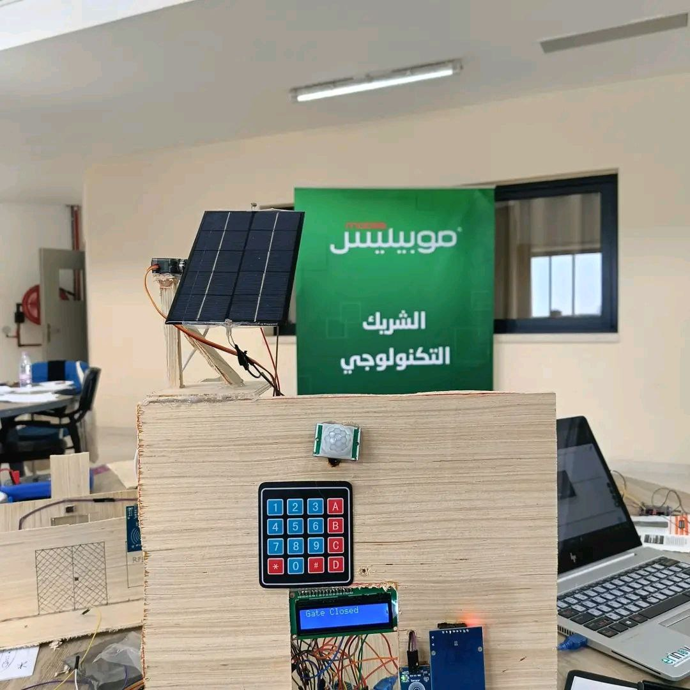


## System Architecture

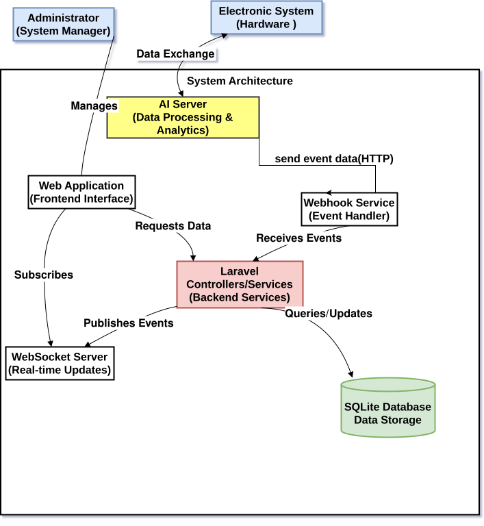

## Technology Stack

- **Backend**: Laravel PHP framework
- **Frontend**: React with TypeScript
- **UI Components**: shadcn/ui and radix-ui
- **Routing**: Inertia.js for seamless SPA experience
- **Styling**: Tailwind CSS with custom green color palette
- **Real-time Updates**: WebSockets for live data streaming
- **Security**: HMAC authentication and AES-256-CBC encryption

### **Core Modules – One Feature per Line**

1. **Access Control System:** Authenticates employees via RFID cards and logs access attempts.
2. **Access Logs:** Tracks successful and failed access events in real-time.
3. **Employee Management:** Supports photo capture/import for employee profiles.
4. **Access Notifications:** Sends instant alerts upon access events.
5. **Temperature Monitoring:** Continuously tracks and logs temperature data.
6. **Humidity Monitoring:** Monitors humidity levels and stores historical data.
7. **Threshold Alerts:** Sends alerts when environmental limits are exceeded.
9. **Cooling Trigger:** Automatically activates cooling when needed.
10. **Decision Logging:** Records the reasoning behind AI decisions.

12. **Unauthorized Access:** Detects and logs unapproved entry attempts.
13. **System Anomalies:** Identifies and alerts on abnormal system behavior.
14. **Security Alerts:** Provides real-time notifications for incidents.
15. **Incident Tracking:** Logs responses to security incidents.
16. **Manual Cooling:** Allows manual initiation of cooling systems.
17. **AI Cooling:** Enables AI-triggered climate control.
18. **Cooling Logs:** Tracks the history and outcomes of cooling actions.
19. **System Integration:** Connects with building management for coordinated control.


## Security Features

### HMAC Authentication

The system implements HMAC (Hash-based Message Authentication Code) to verify the authenticity of webhook requests

### Data Encryption

Sensitive data is protected using industry-standard encryption:

- AES-256-CBC encryption algorithm
- Base64 encoding for data transfer
- Secure key management
- Random initialization vectors (IV) for each encryption operation


### Data Flow

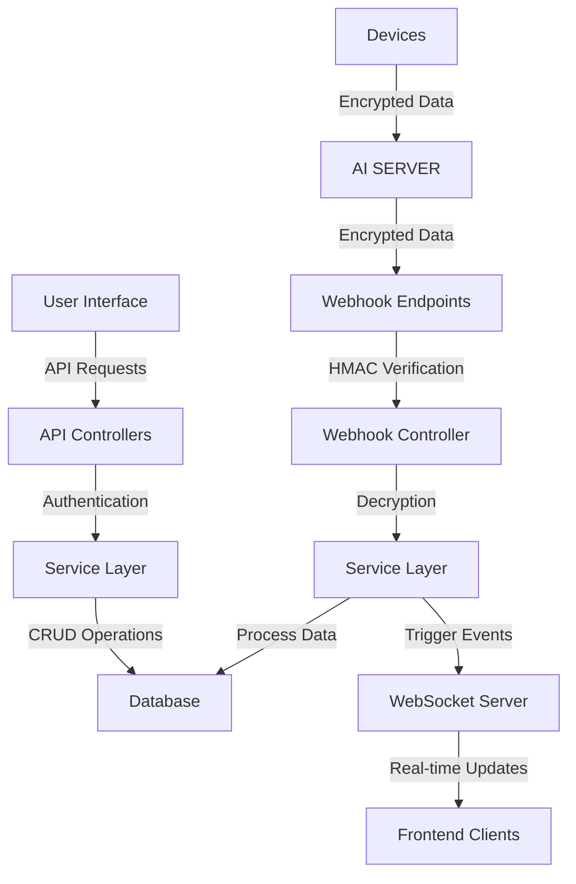

## Database Schema


### Entity Relationship Diagram

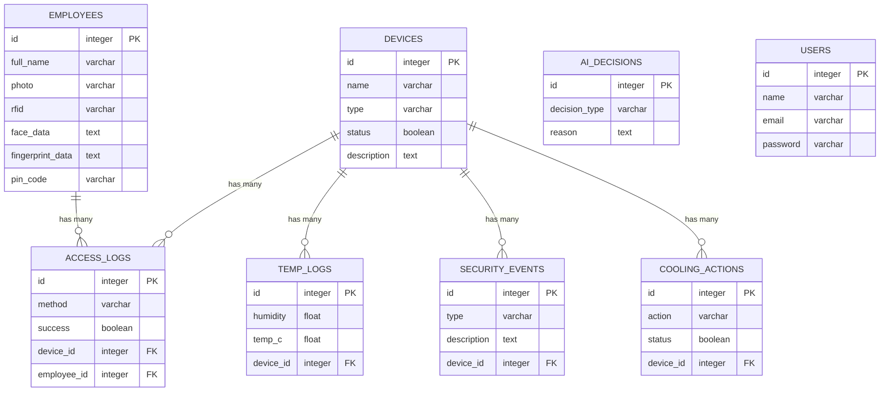

## Webhook Integration

The NEST system provides a robust webhook API for integrating with external systems and IoT devices. The webhook system is secured with HMAC signature verification and supports encrypted payloads.

### Webhook Endpoints

- **Main Webhook Handler**: `POST /api/webhook`
  - Processes various event types from AI system
  - Secured with HMAC signature verification
  - Supports encrypted payloads using AES-256-CBC


### HMAC Authentication

All webhook requests must include an HMAC signature for verification:

1. Calculate an HMAC-SHA256 signature using the request payload and the shared secret key
2. Add the signature to the `X-Webhook-Signature` header
3. The server verifies the signature before processing the request

```php
// Example signature calculation in PHP
$signature = hash_hmac('sha256', $payload, $secret);
```

### Encrypted Payloads

For enhanced security, webhook payloads can be encrypted:

1. Set `encrypted: true` in the request payload
2. Encrypt the data using AES-256-CBC with a shared encryption key
3. Base64 encode the encrypted data

 ## Dashboard Screenshots
 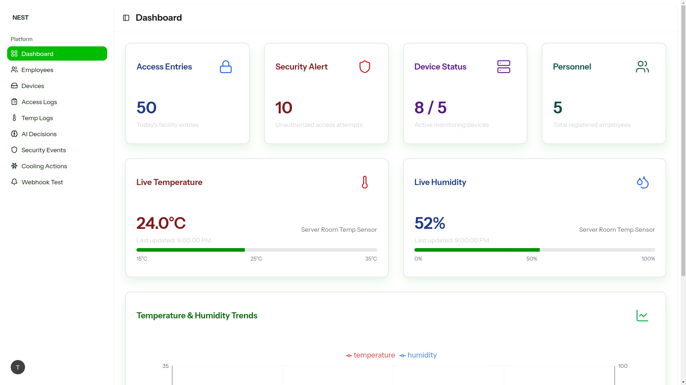
  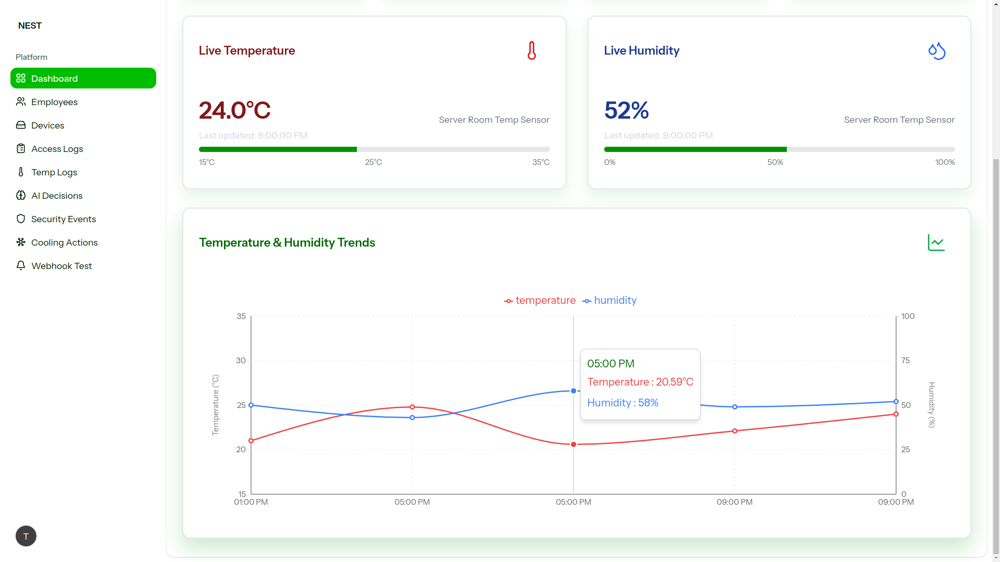
   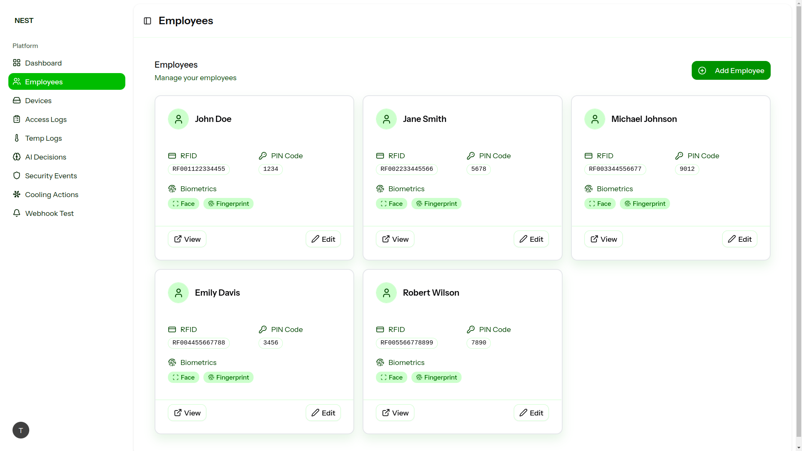
    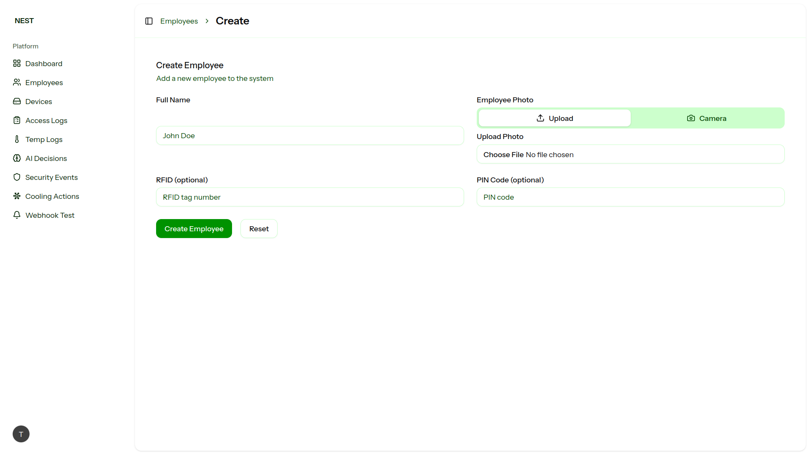
     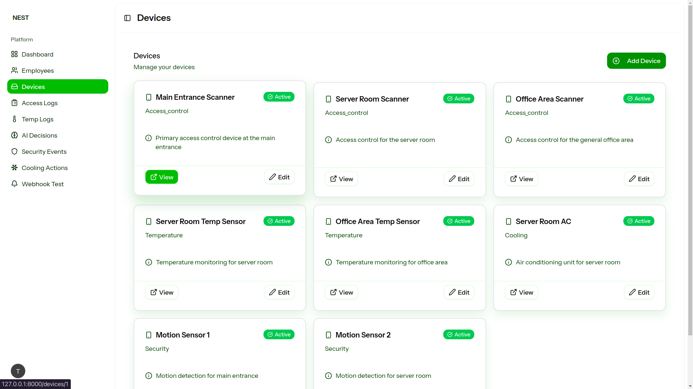
      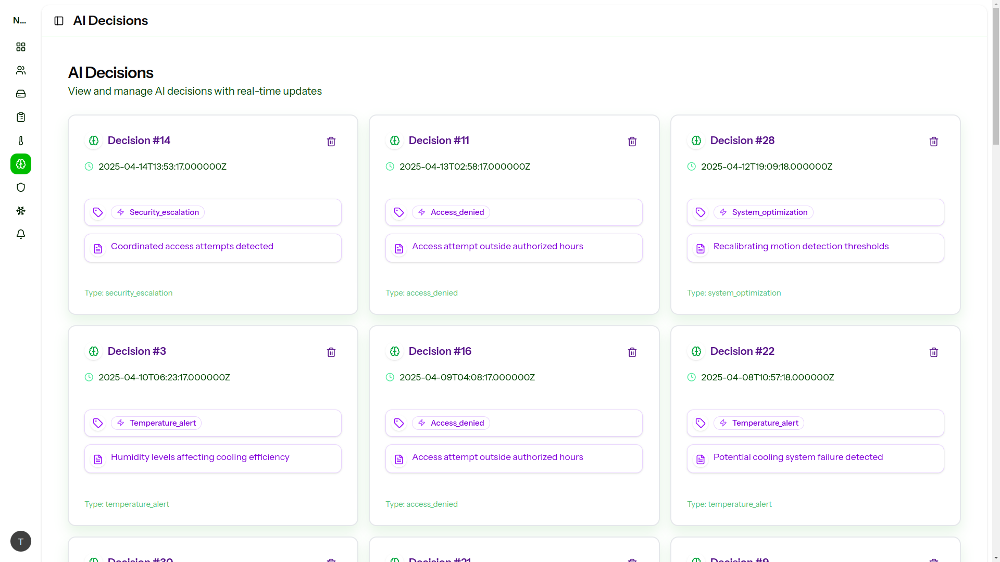 
      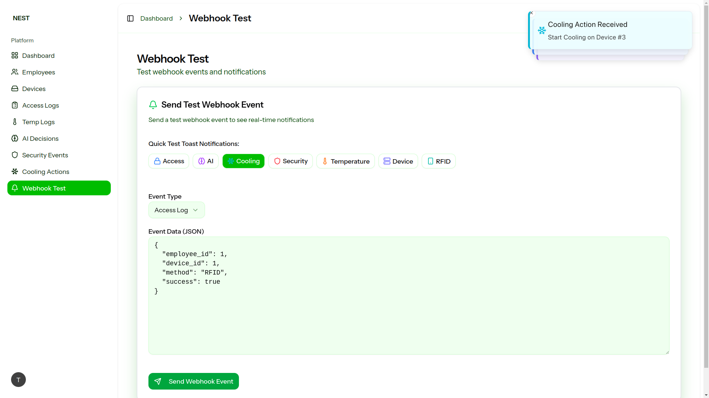


